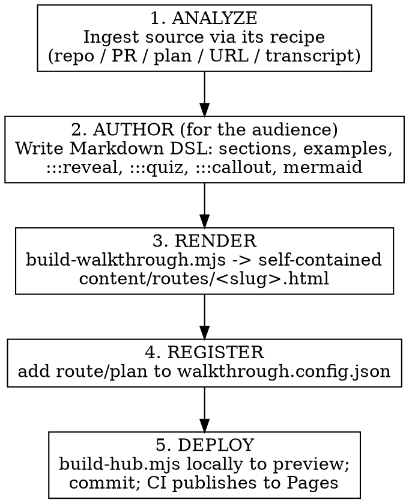

# Walkthrough

Turn any source into a **deployable learning site**: self-contained, offline
`walkthrough.html` "routes" organized by a React/Vite hub (the document center) that also
renders `plan.md` / `design.md`. You author content for a target audience; a build script
renders polished, consistent HTML; CI publishes to GitHub Pages.

**Core principle:** you author *Markdown DSL*, not HTML. The build script owns syntax
highlighting, diagram rendering, the TOC, quizzes, and progress — so every route is
consistent and offline-capable. Hand-writing HTML (or hand-drawing SVG, or hand-tokenizing
code) is the anti-pattern this skill exists to prevent.

**Audience principle (hard rule):** everything that renders in the browser is **for the
learner and no one else** — never the author, a reviewer, or an agent. Never render
authoring meta-commentary ("an older draft said…", "myth correction", "verified against
source", "don't teach the old version", "TODO"). State the correct thing plainly as
settled fact; keep any correction-of-the-source in your reply to the user, not on the page.
The build runs an **audience linter** that flags these; treat hits as defects. See
`references/pedagogy.md` → *The learner is the only reader*.

**Theme:** every generated page (routes and hub) ships **both a light and a dark palette**
baked in — default light, with a persisted toggle (no flash on load, no runtime fetch).
Code highlighting uses Shiki dual themes (CSS-variable mode), so light/dark switch offline.

## First decide: standalone file or hub site? (ask before building)

These are two different deliverables. **Always confirm which one the user wants before
authoring** — do not assume the full site. Ask plainly, e.g. *"Do you want a single
standalone `walkthrough.html` you can open/email offline, or a full deployable learning hub
site (multiple walkthroughs + plans, published to Pages)?"*

- **Standalone route (one-off).** A single shareable/offline `walkthrough.html`. Do steps
  1–3 only — author DSL, run `build-walkthrough.mjs --out <anywhere>.html`, hand over the
  file. Skip the hub, config, and deploy. Fully self-contained.
- **Hub site (collection).** A deployed document center organizing many walkthroughs +
  plans. Do all five steps and deploy the hub.

If the user is ambiguous or names only one source, default to **asking** rather than
building the whole site.

## When to use

- Onboarding someone into a repo or set of repos
- Walking through a PR/MR, a plan, or an architecture/design for review
- Turning an article, blog post, book, lecture, or transcript into an interactive explainer
- Any content that benefits from an interactive, taught, shareable rendering

**When not to use:** live Socratic tutoring with mastery gating → use the `teach` skill.
A one-paragraph answer → just answer.

## Architecture (hub over routes)

- **Routes** = self-contained `walkthrough.html` files. Inline CSS, pre-rendered SVG
  diagrams, pre-highlighted code, tiny JS. Open by double-click, emailable, work offline.
- **Hub** = a React/Vite app that indexes/links routes and renders plans. The front door.
- Everything is vendored into the target repo's **`.walkthrough/`** and committed; CI
  builds and publishes to Pages.

## Pipeline



0. **Decide the deliverable** — confirm standalone file vs hub site (see above) plus the
   **audience** and **goal**. Don't build the hub unless the user wants the collection.
1. **Analyze** — read the source using the matching recipe in `references/source-recipes.md`.
2. **Author** — write a Markdown DSL source per `references/dsl-syntax.md`, structured with
   the non-gating pedagogy in `references/pedagogy.md`. Order prerequisites first; use
   `:::reveal` for try-then-show and `:::quiz` for non-gating self-checks.
3. **Render** — `node scripts/build-walkthrough.mjs <src>.md --out .walkthrough/content/routes/<slug>.html`.
4. **Register** — add the route (and any rendered plans) to `walkthrough.config.json`.
5. **Deploy** — first time: `bash scripts/setup-deploy.sh --repo <target> --base /repo/`.
   To preview locally, build the hub with `--base /` (not `/repo/`) and serve it over HTTP
   **without** single-page mode (`cd .walkthrough/dist && npx serve -l 3000 .`) — see the
   preview footguns in `references/deployment.md`. Then tell the user to commit and enable
   Pages (**Settings → Pages → Source = "GitHub Actions"**, or the first run fails at
   *Configure Pages* and the site keeps serving the repo `README`). Deploys fire only on
   pushes to the default branch. See `references/deployment.md`.

## Setup note

The build scripts have npm dependencies. First use: `npm install` in `scripts/`. Installing
the optional `@mermaid-js/mermaid-cli` enables **light pre-rendered SVG** diagrams; without
it diagrams still render offline via an inlined runtime (larger files).

## Quick reference

| Need | Do |
|------|-----|
| Author content | Markdown DSL (`references/dsl-syntax.md`) — never raw HTML |
| Highlight code | fenced ```` ```lang ```` — Shiki, automatic |
| Diagram | ```` ```mermaid ```` — pre-rendered SVG (or offline runtime) |
| Self-check (non-gating) | `:::quiz` with `- ( )` / `- (x)` + `>` explanation |
| Try-then-reveal | `:::reveal <prompt>` |
| Custom UI | `:::html` (self-contained only) |
| Render a route | `node scripts/build-walkthrough.mjs src.md --out …/routes/slug.html` |
| Customize code themes | `--light-theme <name> --dark-theme <name>` (Shiki themes; default `github-light`/`night-owl`) |
| Build hub for deploy | `node scripts/build-hub.mjs --root …/.walkthrough --base /repo/` |
| Preview hub locally | build with `--base /`, then `cd …/.walkthrough/dist && npx serve -l 3000 .` (no `-s`) |
| Scaffold a repo | `bash scripts/setup-deploy.sh --repo <repo> --base /repo/` |

## Common mistakes

- **Hand-writing HTML / SVG / highlighted code.** The build script does this consistently
  and offline. Authoring raw HTML drifts in quality and breaks the offline guarantee. Use
  the DSL; reserve `:::html` for genuinely custom widgets.
- **Gating quizzes.** All checks are non-gating and retryable. Never hide content behind a
  correct answer. (For gated mastery learning, that's the `teach` skill, not this one.)
- **CDN `<script>`/`<link>` tags.** Anything fetched at runtime breaks offline/emailable.
- **Forgetting to register the route** in `walkthrough.config.json` — the hub won't show it.
- **Summarizing instead of teaching.** Produce a learning artifact (explain → example →
  check → synthesis), not a recap.
- **Addressing anyone but the learner.** No meta-commentary, no notes-to-the-author, no
  "an earlier version got this wrong." The learner is the only reader; the audience linter
  flags the common tells. See `references/pedagogy.md`.

## References

- `references/dsl-syntax.md` — the authoring DSL (frontmatter, code, mermaid, containers)
- `references/source-recipes.md` — per-source ingestion + shaping
- `references/pedagogy.md` — non-gating, audience-aware, Bloom-informed authoring
- `references/deployment.md` — `.walkthrough/` layout, config, setup, CI, GitLab-later
- The repo's `teach` skill — pedagogy evidence base (gated tutoring; complementary, not this)
