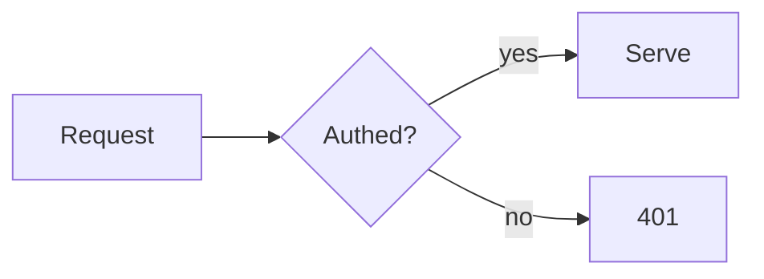

# Walkthrough DSL Reference

A walkthrough **source** is a Markdown file (`content.md`) with YAML frontmatter and
a few container blocks. `build-walkthrough.mjs` compiles it into one self-contained,
offline `walkthrough.html`. **You author the DSL — never hand-write HTML.** The build
script owns highlighting, diagrams, TOC, and interactivity, so every route looks
consistent and polished.

## Frontmatter (required)

```yaml
---
title: Onboarding — Auth Service        # shown in sidebar + <title>
audience: engineers                       # engineers | PMs | designers | ... (shapes nothing mechanically; it's a badge + your writing target)
summary: How login, sessions, and refresh work end to end.
tags: [auth, onboarding, sessions]        # chips in sidebar + hub card
source: repo                              # repo | pr | plan | design | url | transcript | ...
id: auth-onboarding                       # optional; slug for output filename + localStorage key
---
```

`title` is the only field the build strictly needs; everything else enriches the output.
`audience` and `source` are free-form strings shown **verbatim** as badges/labels (the
suggested values are conventions, not a validated enum — use whatever fits, e.g.
`source: article`). Their capitalization/spacing render exactly as written.

## Standard Markdown

GFM is supported: headings, lists, tables, blockquotes, bold/italic, links, inline
`code`. **Headings `#`/`##`/`###` become the TOC sidebar** (with scroll-spy), so
structure your content with clear headings.

## Code blocks → Shiki (pre-highlighted)

Fenced code is highlighted at build time with inline styles (no runtime, no CDN):

````
```js
const x = debounce(fn, 200);
```
````

Supported langs include js, ts, jsx, tsx, json, bash, python, go, rust, java, c, cpp,
html, css, yaml, sql, diff, md. Unknown languages render as plain text (no error).

## Diagrams → `mermaid`

````

````

At build time: if `@mermaid-js/mermaid-cli` is installed, the diagram is **pre-rendered
to inline SVG** (file stays ~tens of KB). If not, the Mermaid runtime is inlined so it
still renders **offline** (heavier file). Either way the output needs no network. Prefer
installing mermaid-cli for light files.

## Container blocks

Containers open with `:::name [args]` on its own line and close with `:::`. They do
**not** nest inside each other in v1, but their bodies render full Markdown — lists, code
fences, tables, and emphasis inside a `:::reveal` or a `:::quiz` explanation all work.

### `:::quiz` — non-gating self-check

```
:::quiz
Which technique fits a search-as-you-type box that calls an API?
- ( ) Throttle
- (x) Debounce
- ( ) Call the API every keystroke
> Debounce waits until typing stops, collapsing a burst into one request.
:::
```

- First lines (before options) = the question (Markdown allowed).
- `- ( )` = wrong option, `- (x)` = correct option. Multiple `(x)` allowed.
- Lines starting with `>` = the explanation, revealed after answering.
- **Behavior:** clicking shows correct/incorrect instantly and reveals the explanation.
  Fully retryable, never blocks progress. This is the core non-gating primitive.

### `:::reveal <prompt>` — try-then-show

```
:::reveal What will this print, and why?
It prints `3` — the closure captures `i` by reference after the loop ends.
:::
```

Renders a collapsed "try it yourself first" block the learner expands when ready.

### `:::callout note|tip|warning|info`

```
:::callout warning
Common mistake: using debounce for a scroll progress bar — it only updates after
scrolling stops, which feels broken.
:::
```

### `:::html` — escape hatch

```
:::html
<div class="my-custom-widget">...raw HTML/CSS/JS...</div>
:::
```

Use **only** when a concept genuinely needs custom interactive UI the other blocks
can't express. Keep it self-contained (inline styles/scripts) so the file stays offline.

## Building

```bash
node scripts/build-walkthrough.mjs content.md --out content/routes/<slug>.html
# --light-theme github-light  (Shiki light theme; default)
# --dark-theme  night-owl     (Shiki dark theme; default. --theme is an alias)
# --quiet                     (suppress build log)
```

The page ships both palettes (light default + persisted toggle); code is highlighted with
Shiki dual themes so light/dark switch offline with no re-render. The build prints which
diagram path it used and the final file size. Then add the route to
`walkthrough.config.json` (see deployment.md).

## Anti-patterns

- ❌ Hand-writing `<svg>`, hand-tokenizing code, or hand-building HTML pages. The build
  script does this consistently — authoring raw HTML defeats the point and drifts in quality.
- ❌ Gating quizzes ("you must answer to continue"). All checks are non-gating by design.
- ❌ Pulling libraries from a CDN inside `:::html`. Breaks the offline guarantee.
